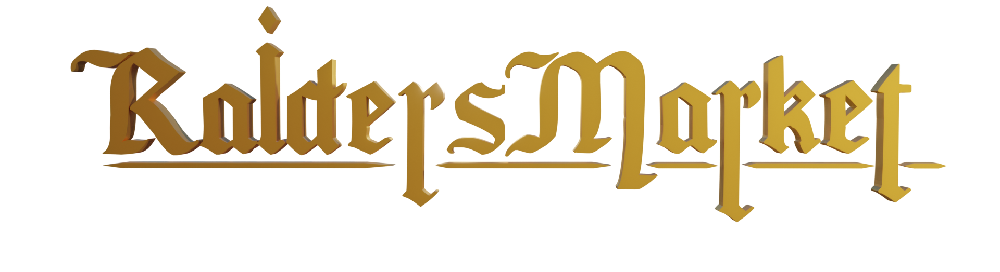

## Download

Downloads, in depth-features list & screenshots on the website https://rm.ygstr.com

### Patch notes

https://github.com/J-MOV/RaidersMarket/releases

## Game features

-   Raid dungeons and kill monsters by clicking their weakpoints.
-   Gather loot and gold from doing raids.
-   Spend the gold and sell the loot on an open market that all players share without commissions.
-   Every item dropped is unique, with a history and some have a random color.
-   Leaderboard, sorted by gold balance. Inspect other players and see all items they have equipped.

## Server repo and database structure explanation

https://github.com/J-MOV/RaidersMarket-Server

### Unity version

[2019.4.19f1](https://unity3d.com/unity/qa/lts-releases)

### Dependencies (Automatically installs by Unity on startup)

-   [Newtonsoft Json.NET](https://www.newtonsoft.com/json) Serilize and deserialize json packets from and to the game server.

-   [NativeWebSocket](https://github.com/endel/NativeWebSocket) Communication with the game server
